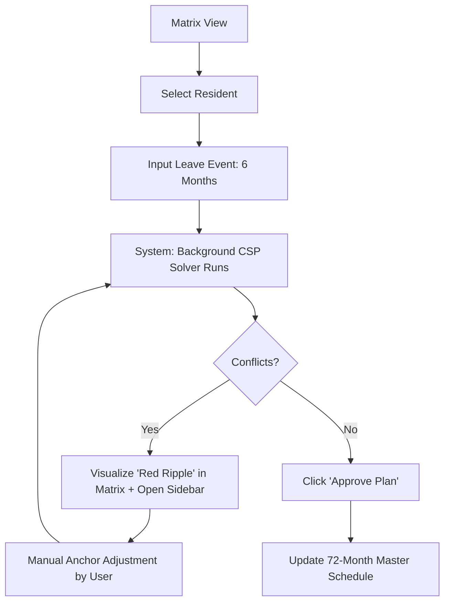
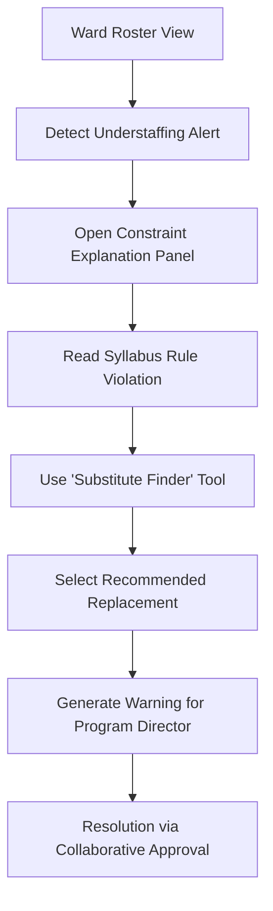

# UX Design Specification - ResiPlanAI

**Author:** Amit
**Date:** 2025-12-29

<!-- Content will be appended sequentially through collaborative workflow steps -->

## Executive Summary

### Project Vision
ResiPlanAI is a B2B SaaS platform that transforms the chaotic, manual process of OB/GYN residency scheduling into a streamlined, compliant, and automated workflow. It replaces "Excel and Highlighters" with an intelligent Constraint Satisfaction Engine that guarantees regulatory compliance and ward safety.

### Target Users
*   **Program Directors (Primary):** Highly specialized medical administrators who need "God View" control and absolute trust in the system's regulatory logic.
*   **Station Managers:** Ward leads who need clear visibility into their specific staffing rosters and immediate feedback on staffing gaps.
*   **Auditors:** External regulators requiring immutable, clear proof of syllabus adherence.

### Key Design Challenges
*   **Visualizing Complexity:** Displaying a 72-month x 40-resident matrix ("God View") on a standard screen without overwhelming the user.
*   **Trust & Transparency:** The AI cannot be a black box. Every automated decision or conflict flag must be explicitly explained in plain medical/regulatory terms.
*   **Interaction Density:** Managing complex drag-and-drop operations where a single move can trigger a cascade of constraint violations across 6 years.

### Design Opportunities
*   **The "Anchor Paradigm":** Creating a satisfying, tactile interaction for locking specific rotations, giving the user a sense of control over the AI.
*   **Instant "Ripple" Feedback:** Using immediate visual cues (Red/Green/Yellow) to show the downstream impact of a decision before it is even finalized.

## Core User Experience

### 2.1 Defining Experience
The core loop revolves around the **"Anchor & Solve"** pattern. Users do not manually schedule every single slot. Instead, they "Anchor" the critical fixed points (vacations, rotations they specifically want), and the system solves the fluid space in between. The experience is collaborative: Human sets strategy, AI handles logistics.

### 2.2 User Mental Model
Users approach the system with a **"Residency Tetris"** mental model. They view the 6-year syllabus as a series of rigid blocks that must be fit into a limited container (The Ward Capacity). They expect a "Ripple Effect"—knowing that a change in Year 1 will impact Year 6—and they look to the system to manage the complexity of that ripple safely.

### 2.3 Success Criteria
*   **Zero Latency Perception:** Conflict validation must feel instantaneous.
*   **Explanatory Feedback:** Every "Red" state must provide a plain-English reason for the violation.
*   **Constraint Preservation:** The user must feel 100% confident that the AI will never move an "Anchor" they have set.

### 2.4 Novel UX Patterns
We are introducing the **"Anchor-First Interaction"**—a hybrid of a data grid and a constraint-solver. Unlike a traditional spreadsheet where every cell is equal, ResiPlanAI cells have "Weights." An "Anchored" cell has infinite weight, while "Fluid" cells (AI-generated) are suggestions that adapt in real-time.

### 2.5 Experience Mechanics
1.  **Initiation:** User identifies a rotation that must happen at a specific time (e.g., a pre-booked vacation or a specific elective).
2.  **Interaction:** User clicks the cell and selects the **"Anchor"** action.
3.  **Feedback:** The cell undergoes a visual transition to a "Locked" state (bold border, padlock icon). The surrounding cells may "Pulse" or shift color as the AI re-calculates the matrix.
4.  **Completion:** The "Compliance Indicator" (Status Bar) updates to show 100% validity or highlights new conflicts created by the manual anchor.

## Core User Experience (Legacy)

### Defining Experience
The core loop revolves around the **"Anchor & Solve"** pattern. Users do not manually schedule every single slot. Instead, they "Anchor" the critical fixed points (vacations, rotations they specifically want), and the system solves the fluid space in between. The experience is collaborative: Human sets strategy, AI handles logistics.

### Platform Strategy
*   **Primary Platform:** Desktop Web (1920x1080 min resolution recommended).
*   **Reasoning:** The "God View" matrix requires significant screen real estate to be legible. Mobile is restricted to "View Only" or specific "Task Lists," not matrix manipulation.
*   **Input Method:** Mouse/Trackpad optimization for precise drag-and-drop operations.

### Effortless Interactions
*   **Predictive Dragging:** As a user drags a resident tile, valid target slots glow green, while invalid slots dim or turn red, preventing errors before they happen.
*   **Instant Context:** Hovering over any slot instantly reveals the "Constraint Context" (Why is this here? What rules affect this slot?) without requiring a click-through to a detail page.

### Critical Success Moments
*   **The "Green Wave":** The visceral satisfaction of resolving a bottleneck constraint and watching the entire 6-year schedule instantly re-align to a valid, green state.
*   **One-Click Audit:** The relief of generating a complex, legally binding regulatory report with a single interaction, knowing it is 100% accurate.

### Experience Principles
1.  **Human Authority:** The user's "Anchor" is absolute. The AI optimizes around the human, never overruling a manual decision.
2.  **Radical Transparency:** No "Black Box" errors. Every conflict must be explained with the specific syllabus rule or capacity limit that caused it.
3.  **Visual Speed:** Interaction feedback must be perceptible instantly to maintain the illusion of manipulating a physical object, despite the heavy computation in the background.

## Desired Emotional Response

### Primary Emotional Goals
The primary emotional goal of ResiPlanAI is **Total Cognitive Relief**. We want the Program Director to move from a state of "High-Alert Anxiety" (fear of regulatory non-compliance) to a state of **Confident Flow**. The user should feel **Empowered** as the strategist and **Relieved** of the logistical burden.

### Emotional Journey Mapping
*   **Initial Engagement:** Relief and Surprise. "I can actually see the next 6 years in one view."
*   **The Problem-Solving Phase:** Engagement and Clarity. When a conflict appears, the user feels a sense of focus, not frustration, because the path to resolution is clear.
*   **The "Resolve" Moment:** Triumph. Watching the "Green Wave" ripple through the schedule provides a visceral sense of accomplishment.
*   **Post-Task:** Professional Peace. The user closes their laptop with the absolute certainty that their program is 100% audit-proof.

### Micro-Emotions
*   **Trust:** Cultivated by "Transparent Logic." The system never says "No" without saying "Why."
*   **Control:** Maintained by the "Anchor" mechanic. The user always feels like the pilot, with the AI as the co-pilot.
*   **Precision:** A sense that every month and every resident is perfectly accounted for, leaving no room for "human error" doubt.

### Design Implications
*   **Empowerment → Tactile Anchors:** The act of "locking" a slot should feel heavy and permanent, using bold visual states.
*   **Clarity → The "Why" Layer:** A non-intrusive info layer that can be toggled or hovered to see the underlying syllabus logic.
*   **Calm → Proactive Warning System:** Rather than an "Error Message" (which is punitive), use "Guidance Cues" that show valid paths during the drag-and-drop interaction.

### Emotional Design Principles
1.  **Acknowledge the Stakes:** Recognize that a schedule error is a career risk for the resident. The UI should feel professional, serious, and high-fidelity.
2.  **Celebrate Compliance:** Make the state of "All Green" feel like a hard-won victory through subtle visual Polish.
3.  **Human-Centered AI:** The system should speak in the language of the Program Director ("Syllabus Window") rather than the language of a database ("Constraint Violation 402").

## UX Pattern Analysis & Inspiration

### Inspiring Products Analysis
*   **Airtable:** We draw inspiration from Airtable's ability to turn dense data into a "Visual Playground." Their use of **conditional formatting** and **tactile grid interactions** is the gold standard for managing complex sets of information like a 72-month residency matrix.
*   **Linear:** Linear provides the blueprint for **"High-Performance Tooling."** Their minimalist aesthetic and focus on **keyboard-driven efficiency** align perfectly with our goal of making the Program Director feel like a fast, effective strategist.
*   **Google Calendar:** For time manipulation, we look to Google Calendar's **drag-and-drop paradigm**. The ability to move blocks of time and see the schedule adjust in real-time is an interaction pattern users already know and trust.

### Transferable UX Patterns
*   **The "Smart Grid":** Using row-shading and bold color states for cells (Green for compliant, Red for conflict, Amber for warning) to allow for "Scanning" rather than "Reading."
*   **Command Palette:** Implementing a "Quick Jump" command (e.g., Cmd+K) to allow managers to instantly find "Resident X" or jump to "Year4" without manual scrolling.
*   **Ghosting & Predictive Feedback:** During a drag operation, the destination slots will show a "Ghosted" preview of the resident's path, along with real-time constraint validation symbols.

### Anti-Patterns to Avoid
*   **Spreadsheet Blindness:** Avoiding the "Sea of Gray." We must use spacing and visual breathing room to prevent the cognitive load associated with traditional hospital Excel sheets.
*   **The "Black Box" Error:** Never show a conflict state without an immediate, accessible explanation of the underlying syllabus rule.
*   **Interruption Modals:** Avoiding the "Stop! You can't do that" popup. The user should be allowed to make an "invalid" move to see the ripple effect, as long as it's clearly flagged for resolution.

### Design Inspiration Strategy
*   **Adopt:** **High-Contrast Status States.** Use bold, unequivocally colors for compliance status to ensure trust at a glance.
*   **Adapt:** **Multi-Year Navigation.** Adapt the "Mini-Map" pattern (often seen in code editors or design tools) to allow users to navigate the massive 72-month timeline quickly.
*   **Avoid:** **Complex Nested Menus.** Keep the most common actions (Anchor, Resolve, Export) visible on the primary dashboard level.

## Design System Foundation

### 1.1 Design System Choice
**MUI (Material UI) for React.**

### Rationale for Selection
*   **Data Grid Dominance:** The core of ResiPlanAI is the "God View" matrix. MUI's DataGrid component is the industry leader for handling complex, virtualized, editable datasets. Building this from scratch would be a massive risk.
*   **Enterprise Density:** MUI supports "High Density" modes natively, allowing us to fit significantly more information on the screen without sacrificing legibility—a critical requirement for the 72-month timeline.
*   **Familiarity & Trust:** The Material Design language is ubiquitous in enterprise SaaS and healthcare. It communicates "Professional Tool" immediately, reducing the learning curve for Program Directors used to EMRs.

### Implementation Approach
*   **Component Strategy:** We will utilize MUI's core library for all standard inputs (Buttons, Selects, Modals) and leverage the DataGrid component for the main interface.
*   **Icons:** Use **Phosphor Icons** or **Heroicons** instead of standard Material Icons to give the app a more modern, polished feel (avoiding the "Generic Google App" look).

### Customization Strategy
*   **Theming:** We will override the default "Material Blue" with a **Clinical Teal & Slate** palette.
*   **Typography:** Replace the default Roboto font with **Inter** or **Public Sans** for better readability at small sizes (crucial for grid data).
*   **Shape:** Reduce border-radius to 4px or 6px (from the default 4px/8px mix) to create a sharper, more data-focused aesthetic.

## Visual Design Foundation

### Color System
Our color system is designed for **"Instant Compliance Awareness."**
*   **Primary:** `Clinical Teal (#00796B)` - Used for primary actions and active states, providing a calm, healthcare-oriented aesthetic.
*   **Surface:** `Soft Gray (#F5F7F9)` - A cool-toned light gray to serve as the canvas for the 72-month grid, reducing ocular fatigue.
*   **Semantic Feedback:**
    *   **Success:** `Deep Green (#2E7D32)` - High-saturation green for "Compliant" states.
    *   **Warning:** `Amber (#FFA000)` - Used for soft conflicts (e.g., Ward Capacity at 90%).
    *   **Error:** `Medical Red (#C62828)` - Critical regulatory or safety violations.
    *   **Anchor:** `Midnight Blue (#1A237E)` - A distinct, heavy color to denote manually locked "Anchor" slots.

### Typography System
*   **Primary Typeface:** **Inter** (Sans-Serif).
*   **Rationale:** Inter's tall x-height and precise letterforms make it ideal for the high-density grid requirements of ResiPlanAI. It maintains legibility even at the 11px/12px sizes required for the 72-month matrix.
*   **Hierarchy:**
    *   **H1 (Page Header):** 24px Semi-Bold / 32px Line-height.
    *   **Body (Primary):** 14px Regular / 20px Line-height.
    *   **Grid Labels:** 11px Medium / 14px Line-height (Optimized for density).

### Spacing & Layout Foundation
*   **Spacing System:** A **4px linear scale** to allow for the fine-grained control needed in a dense interface.
*   **Grid Density:** **Ultra-Compact.** Grid cells will have minimal internal padding (4px-6px) to maximize the number of months visible on screen simultaneously.
*   **Structural Layout:** A "God View" primary viewport with a collapsible "Constraint Panel" on the right that provides plain-English explanations of conflicts.

### Accessibility Considerations
*   **Color Blindness:** We will not rely on color alone for status. Compliance states will use distinct iconography (e.g., Checkmark for Green, X for Red, ! for Amber) in addition to color.
*   **Contrast:** All text-to-background combinations will be validated against WCAG AA standards (4.5:1 ratio).

## Design Direction Decision

### Design Directions Explored
We explored several iterations of the **"Matrix First"** layout.
*   **Direction 1 (Sidebar Focused):** Traditional navigation with a smaller grid. (Rejected for being too cramped).
*   **Direction 2 (God View):** Full-screen grid with collapsible UI elements. (Selected as base).
*   **Direction 3 (Minimalist):** Very light borders and high white space. (Rejected for feeling too "airy" for a professional medical tool).

### Chosen Direction
**Direction 2 (The God View Matrix).**
The dashboard is dominated by the 72-month resident timeline. Navigation is relegated to a thin sidebar to maximize horizontal real estate. The right-hand side features a context-sensitive "Constraint Panel" that slides out only when a conflict is detected or a cell is selected.

### Design Rationale
*   **Maximized Context:** By prioritizing the grid, we give Dr. Elana the full 6-year visibility she needs to spot bottlenecks early.
*   **Trust Through Explanation:** The sliding "Constraint Panel" ensures that the AI's logic is always one click away, building trust through transparency.
*   **Semantic Anchor State:** The choice of a heavy Midnight Blue border for anchored cells provides a clear visual metaphor for "Unmovable Stability."

### Implementation Approach
We will implement this using **MUI DataGrid Premium** with custom cell renderers for the status states. The "Ripple Effect" will be signaled through a subtle CSS background pulse on affected cells during re-calculation.

## User Journey Flows

### Journey 1: Strategic Course Correction (Dr. Elana)
Dr. Elana manages high-impact life events (e.g., maternity leave) by setting new constraints and observing the ripple effect. The flow prioritizes **"Drafting"**—allowing her to see the outcome before finalizing.

### Journey 2: Ward Compliance Audit (Dr. Amir)
Station Managers use the system to verify that their wards are safely staffed while respecting the residents' academic careers.

### Journey Patterns
*   **Inline Resolution:** All scheduling conflicts are resolved within the main dashboard view, avoiding "Deep Link" fatigue.
*   **Predictive Assistance:** The system doesn't just flag errors; it uses the CSP engine to highlight valid substitute candidates in real-time.

### Flow Optimization Principles
1.  **Reduce Decision Latency:** Use the "Ghost Path" pattern to show the user exactly what will happen *before* they commit a change.
2.  **Explicit Rationalization:** Every "Red" state must be accompanied by a "Why" label reachable in <1 second.
3.  **Audit Persistence:** Every step in the journey that involves a manual override creates a mandatory "Decision Log" entry automatically.

## Component Strategy

### Design System Components
We will use **MUI (Material UI) Premium** as our primary component library.
*   **Core Grid:** `MUI DataGrid Premium` will provide the virtualization and column-pinning required for the 72-month view.
*   **Navigation & Layout:** `MUI Drawer` (Collapsible) for the sidebar and `MUI Appbar` for the "God View" controls.
*   **Feedback:** `MUI Alert` and `MUI Snackbar` for system-level notifications (e.g., "Solver Completed").

### Custom Components

#### 1. Residency Matrix Cell (The Hero Component)
*   **Purpose:** Displays a single month's rotation for a specific resident with integrated status.
*   **Anatomy:** Background layer (Status color), Text layer (Rotation label), Icon layer (Anchor/Warning).
*   **Interaction Behavior:** One-click to select; Double-click to edit rotation; Hover to reveal the "Anchor Toggle" shortcut.
*   **States:** `Compliant` (Teal), `Warning` (Amber), `Error` (Red), `Anchored` (Midnight Blue Border).

#### 2. Conflict Explanation Card
*   **Purpose:** Translates technical CSP constraint failures into plain-English regulatory explanations.
*   **Usage:** Appears in the "Constraint Panel" when a conflict is selected.
*   **Anatomy:** Title (Resident Name + Month), Rule ID, Description, and "Suggested Fix" (e.g., "Move to July").

#### 3. The "Ghost Path" Overlay
*   **Purpose:** Visualizes the "Ripple Effect" of a proposed change before it is applied.
*   **Usage:** Active during drag-and-drop or leave-entry drafting.
*   **Visual Design:** 50% opacity "current state" with a dashed-line "proposed state" overlapping.

### Component Implementation Strategy
*   **Token-Based:** All custom components will use the MUI Theme provider to ensure consistent usage of our **Clinical Teal** and **Inter** typography.
*   **Performance:** The Matrix Cell will be optimized for virtualization to ensure smooth scrolling through the 40x72 matrix.

### Implementation Roadmap
*   **Phase 1 (MVP Essentials):** The Matrix Cell, DataGrid integration, and Conflict Panel.
*   **Phase 2 (UX Polish):** The Anchor Toggle, Ghost Path visualization, and Custom Tooltips.
*   **Phase 3 (Accessibility & Scale):** Advanced filtering components and Keyboard Shortcut manager.

## UX Consistency Patterns

### Button Hierarchy
To maintain visual clarity in a dense UI, we utilize a strictly defined button system:
*   **Action Primary:** `Contained Clinical Teal`. Used for high-impact finalization (e.g., "Apply Schedule").
*   **Action Secondary:** `Outlined Clinical Teal`. Used for navigational or supportive tasks (e.g., "Export for Audit").
*   **Contextual Actions:** `Ghost / Icon-only`. Used inside the DataGrid cells to keep the matrix clean while remaining functional.

### Feedback Patterns
Feedback is categorized by "Decision Impact":
*   **System Feedback (Toasts):** Fleeting messages for non-critical confirmations (e.g., "Resident Data Saved").
*   **Guidance Feedback (Tooltips):** Plain-English explanations of syllabus rules triggered on hover.
*   **Critical Feedback (Sidebar Cards):** Persistent red alerts in the Constraint Panel that prevent schedule finalization until resolved.

### Form Patterns
*   **High-Density Inputs:** We use MUI's `small` size variant for all form controls to align with the compact grid aesthetic.
*   **Progressive Disclosure:** Complex resident data entry is broken into logical steps (Metadata -> Syllabus Assignment -> Historical Data) using a Stepper component.
*   **Auto-Save:** All metadata changes (names, dates) are auto-saved to prevent data loss, while scheduling changes remain in "Draft Mode" until explicitly resolved.

### Navigation Patterns
*   **Global Command Bar:** A central search/action bar (Cmd+K) allows for "Headless Navigation"—jumping between years or residents without manual scrolling.
*   **The "Mini-Map" Scroll:** A visual vertical bar next to the scrollbar that shows color-coded "Conflict Hotspots" across the entire 40-resident list, allowing the user to jump straight to problems.

### Empty States & Loading
*   **Contextual Guidance:** Empty wards or new accounts feature "Call to Action" cards that guide the user to the next step (e.g., "No residents assigned to ER. Click here to populate.").
*   **Skeleton Grids:** During heavy solver re-calculations, the grid remains visible with "Skeleton" overlays to maintain the spatial mental model of the user.

## UX Pattern Analysis & Inspiration

### Inspiring Products Analysis
*   **Airtable:** We draw inspiration from Airtable's ability to turn dense data into a "Visual Playground." Their use of **conditional formatting** and **tactile grid interactions** is the gold standard for managing complex sets of information like a 72-month residency matrix.
*   **Linear:** Linear provides the blueprint for **"High-Performance Tooling."** Their minimalist aesthetic and focus on **keyboard-driven efficiency** align perfectly with our goal of making the Program Director feel like a fast, effective strategist.
*   **Google Calendar:** For time manipulation, we look to Google Calendar's **drag-and-drop paradigm**. The ability to move blocks of time and see the schedule adjust in real-time is an interaction pattern users already know and trust.

### Transferable UX Patterns
*   **The "Smart Grid":** Using row-shading and bold color states for cells (Green for compliant, Red for conflict, Amber for warning) to allow for "Scanning" rather than "Reading."
*   **Command Palette:** Implementing a "Quick Jump" command (e.g., Cmd+K) to allow managers to instantly find "Resident X" or jump to "Year 4" without manual scrolling.
*   **Ghosting & Predictive Feedback:** During a drag operation, the destination slots will show a "Ghosted" preview of the resident's path, along with real-time constraint validation symbols.

### Anti-Patterns to Avoid
*   **Spreadsheet Blindness:** Avoiding the "Sea of Gray." We must use spacing and visual breathing room to prevent the cognitive load associated with traditional hospital Excel sheets.
*   **The "Black Box" Error:** Never show a conflict state without an immediate, accessible explanation of the underlying syllabus rule.
*   **Interruption Modals:** Avoiding the "Stop! You can't do that" popup. The user should be allowed to make an "invalid" move to see the ripple effect, as long as it's clearly flagged for resolution.

### Design Inspiration Strategy
*   **Adopt:** **High-Contrast Status States.** Use bold, unequivocally colors for compliance status to ensure trust at a glance.
*   **Adapt:** **Multi-Year Navigation.** Adapt the "Mini-Map" pattern (often seen in code editors or design tools) to allow users to navigate the massive 72-month timeline quickly.
*   **Avoid:** **Complex Nested Menus.** Keep the most common actions (Anchor, Resolve, Export) visible on the primary dashboard level.

## Design System Foundation

### 1.1 Design System Choice
**MUI (Material UI) for React.**

### Rationale for Selection
*   **Data Grid Dominance:** The core of ResiPlanAI is the "God View" matrix. MUI's DataGrid component is the industry leader for handling complex, virtualized, editable datasets. Building this from scratch would be a massive risk.
*   **Enterprise Density:** MUI supports "High Density" modes natively, allowing us to fit significantly more information on the screen without sacrificing legibility—a critical requirement for the 72-month timeline.
*   **Familiarity & Trust:** The Material Design language is ubiquitous in enterprise SaaS and healthcare. It communicates "Professional Tool" immediately, reducing the learning curve for Program Directors used to EMRs.

### Implementation Approach
*   **Component Strategy:** We will utilize MUI's core library for all standard inputs (Buttons, Selects, Modals) and leverage the DataGrid component for the main interface.
*   **Icons:** Use **Phosphor Icons** or **Heroicons** instead of standard Material Icons to give the app a more modern, polished feel (avoiding the "Generic Google App" look).

### Customization Strategy
*   **Theming:** We will override the default "Material Blue" with a **Clinical Teal & Slate** palette.
*   **Typography:** Replace the default Roboto font with **Inter** or **Public Sans** for better readability at small sizes (crucial for grid data).
*   **Shape:** Reduce border-radius to 4px or 6px (from the default 4px/8px mix) to create a sharper, more data-focused aesthetic.

## Visual Design Foundation

### Color System
Our color system is designed for **"Instant Compliance Awareness."**
*   **Primary:** `Clinical Teal (#00796B)` - Used for primary actions and active states, providing a calm, healthcare-oriented aesthetic.
*   **Surface:** `Soft Gray (#F5F7F9)` - A cool-toned light gray to serve as the canvas for the 72-month grid, reducing ocular fatigue.
*   **Semantic Feedback:**
    *   **Success:** `Deep Green (#2E7D32)` - High-saturation green for "Compliant" states.
    *   **Warning:** `Amber (#FFA000)` - Used for soft conflicts (e.g., Ward Capacity at 90%).
    *   **Error:** `Medical Red (#C62828)` - Critical regulatory or safety violations.
    *   **Anchor:** `Midnight Blue (#1A237E)` - A distinct, heavy color to denote manually locked "Anchor" slots.

### Typography System
*   **Primary Typeface:** **Inter** (Sans-Serif).
*   **Rationale:** Inter's tall x-height and precise letterforms make it ideal for the high-density grid requirements of ResiPlanAI. It maintains legibility even at the 11px/12px sizes required for the 72-month matrix.
*   **Hierarchy:**
    *   **H1 (Page Header):** 24px Semi-Bold / 32px Line-height.
    *   **Body (Primary):** 14px Regular / 20px Line-height.
    *   **Grid Labels:** 11px Medium / 14px Line-height (Optimized for density).

### Spacing & Layout Foundation
*   **Spacing System:** A **4px linear scale** to allow for the fine-grained control needed in a dense interface.
*   **Grid Density:** **Ultra-Compact.** Grid cells will have minimal internal padding (4px-6px) to maximize the number of months visible on screen simultaneously.
*   **Structural Layout:** A "God View" primary viewport with a collapsible "Constraint Panel" on the right that provides plain-English explanations of conflicts.

### Accessibility Considerations
*   **Color Blindness:** We will not rely on color alone for status. Compliance states will use distinct iconography (e.g., Checkmark for Green, X for Red, ! for Amber) in addition to color.
*   **Contrast:** All text-to-background combinations will be validated against WCAG AA standards (4.5:1 ratio).

## Design Direction Decision

### Design Directions Explored
We explored several iterations of the **"Matrix First"** layout.
*   **Direction 1 (Sidebar Focused):** Traditional navigation with a smaller grid. (Rejected for being too cramped).
*   **Direction 2 (God View):** Full-screen grid with collapsible UI elements. (Selected as base).
*   **Direction 3 (Minimalist):** Very light borders and high white space. (Rejected for feeling too "airy" for a professional medical tool).

### Chosen Direction
**Direction 2 (The God View Matrix).**
The dashboard is dominated by the 72-month resident timeline. Navigation is relegated to a thin sidebar to maximize horizontal real estate. The right-hand side features a context-sensitive "Constraint Panel" that slides out only when a conflict is detected or a cell is selected.

### Design Rationale
*   **Maximized Context:** By prioritizing the grid, we give Dr. Elana the full 6-year visibility she needs to spot bottlenecks early.
*   **Trust Through Explanation:** The sliding "Constraint Panel" ensures that the AI's logic is always one click away, building trust through transparency.
*   **Semantic Anchor State:** The choice of a heavy Midnight Blue border for anchored cells provides a clear visual metaphor for "Unmovable Stability."

### Implementation Approach
We will implement this using **MUI DataGrid Premium** with custom cell renderers for the status states. The "Ripple Effect" will be signaled through a subtle CSS background pulse on affected cells during re-calculation.